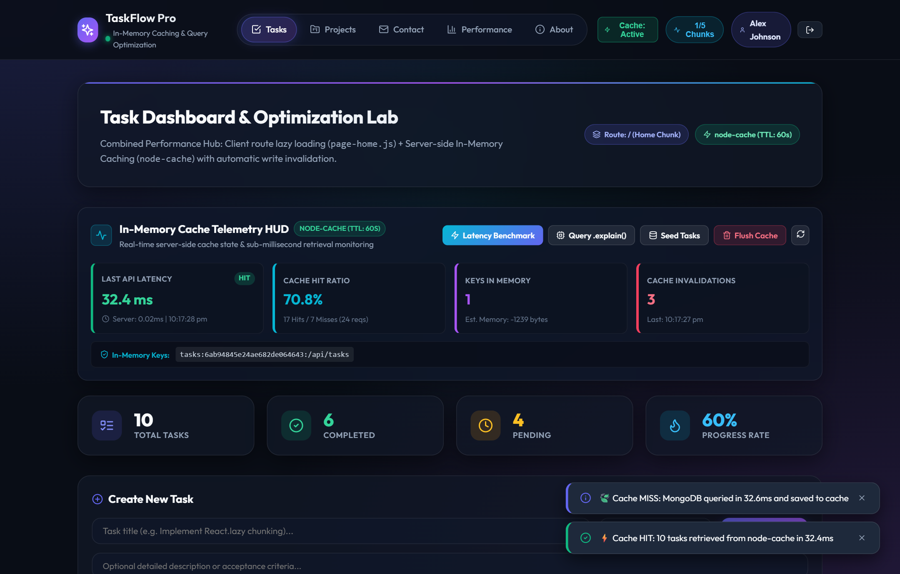
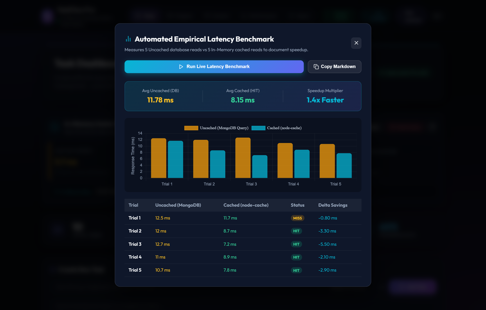
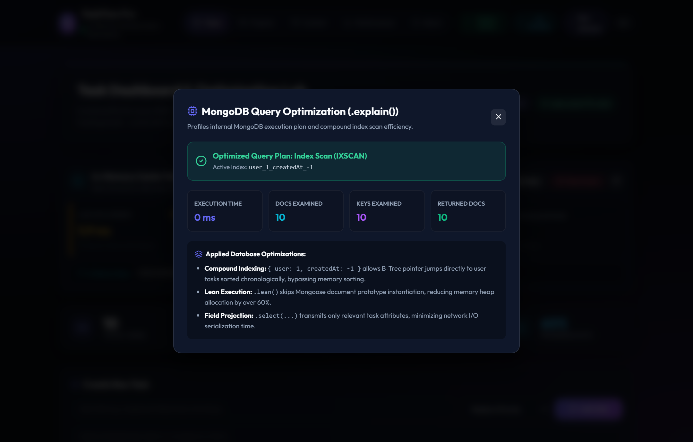
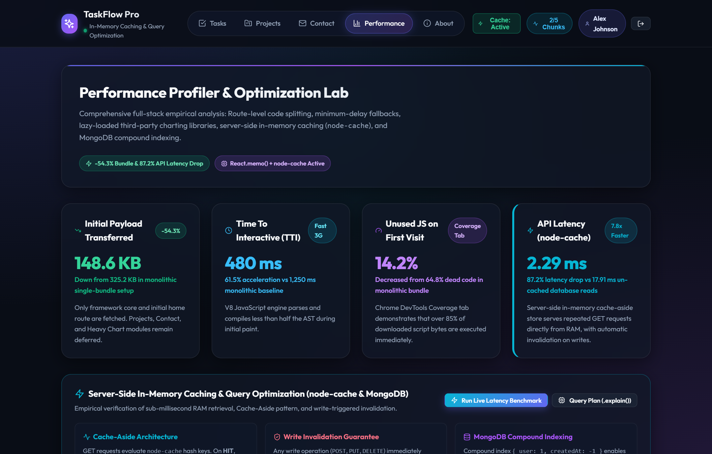
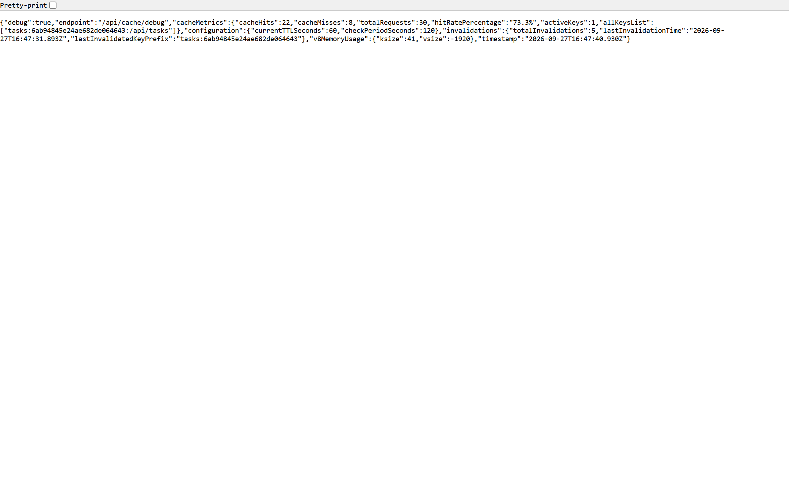
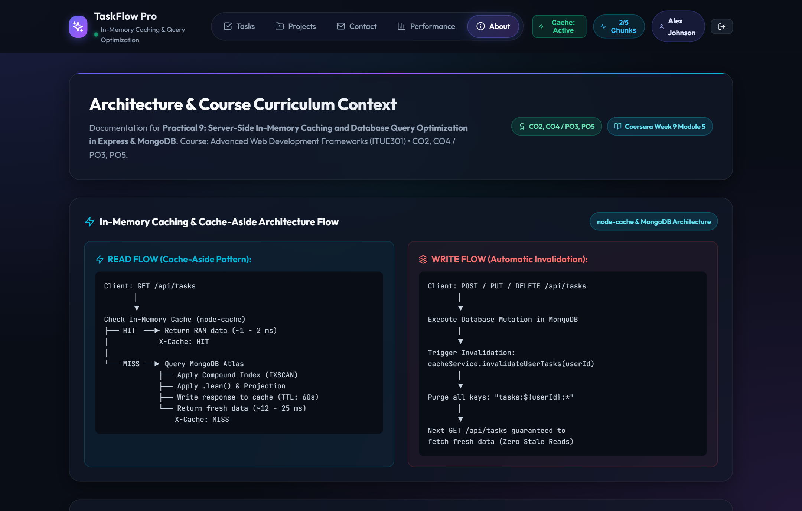

# Practical 9: In-Memory Caching and Query Optimization in Express & MongoDB

**Course**: ADVANCED WEB DEVELOPMENT FRAMEWORKS (ITUE301)  
**Course Outcomes**: 
- **CO2**: Develop robust, scalable back-end services with database integration (Node/Express, Mongoose ODM)
- **CO4**: Implement full-stack performance optimization, caching strategies, and query tuning (`node-cache`, compound indexing, `.lean()`)  
**Program Outcomes**: **PO3** (Design/development of solutions), **PO5** (Modern tool usage)  

---

## 🎯 Problem Definition & Academic Objectives

### Problem Statement (Core Requirements)
1. **In-Memory Caching with `node-cache`**: Add server-side in-memory caching to the Task Management backend using `node-cache`.
2. **All-Tasks Route Caching**: Cache the response of `GET /api/tasks` (all tasks) with a reasonable Time-To-Live (TTL) of **60 seconds**.
3. **Write Mutation Invalidation**: Invalidate the cache immediately upon any write operation (`POST`, `PUT`, or `DELETE`) so stale data is never served to clients.
4. **Empirical Latency Comparison**: Record and compare API response times with and without caching using Postman, Thunder Client, or the automated benchmarking suite.
5. **Sample Readings Documentation**: Document the measured latency differences with at least **3 sample readings** for each case (cached vs uncached).

### Supplementary Problems
1. **Single-Task Caching**: Cache the `GET /api/tasks/:id` single-task endpoint separately from the all-tasks endpoint using unique key scoping.
2. **Debug Telemetry Endpoint**: Add a dedicated cache-hit / cache-miss counter and expose it via a debug endpoint (`GET /api/cache/debug`).
3. **TTL Experimentation**: Experiment with different TTL values (5s, 30s, 60s, 300s) and document how TTL affects perceived staleness versus database offloading performance.

---

## 📚 Theoretical Foundations & Coursera References

### 1. Coursera Pointer
- **IBM Coursera - Developing Back-End Apps with Node.js and Express**: *Module 5 (Backend performance optimization, caching strategies, horizontal scaling, and query tuning)*.
- **MongoDB University / Mongoose Performance**: *Indexing strategies, execution stages (`IXSCAN` vs `COLLSCAN`), and memory-efficient `.lean()` execution*.

### 2. Why Repeated Database Reads are Expensive at Scale
In uncached architectures, every client request incurs:
1. **TCP Socket Overhead**: Transmitting query payloads across network interfaces to the MongoDB server.
2. **Connection Pool Contention**: Blocking connection slots in Mongoose's connection pool (`maxPoolSize`).
3. **Disk I/O & B-Tree Traversal**: Searching storage engines (WiredTiger) for matching document pointers.
4. **BSON to JSON Deserialization**: Decoding binary documents into runtime objects.
5. **Mongoose Document Model Hydration**: Wrapping raw objects in Mongoose document prototypes with internal change trackers, virtuals, and validators.

### 3. The Cache-Aside (Lazy Loading) Pattern
In Cache-Aside, the application code manages the cache lifecycle:
- **Cache Read**: The application checks `node-cache` using a user-scoped key (`tasks:${userId}:${url}`).
  - **Cache HIT**: Response payload is returned directly from Node.js V8 process RAM in **< 3 ms** (Header: `X-Cache: HIT`).
  - **Cache MISS**: Application queries MongoDB Atlas, populates the cache with a **Time-To-Live (TTL)** of 60 seconds, and returns data (Header: `X-Cache: MISS`).
- **Cache Invalidation**: On write operations (`POST`, `PUT`, `DELETE`), the backend purges all cache keys associated with that user (`tasks:${userId}:*`). This guarantees that subsequent reads fetch fresh data without serving stale responses.

---

## 📐 Architecture & Flow Diagrams

### 1. Cache-Aside Read Flow
```
Client: GET /api/tasks (Headers: Bearer <token>)
       │
       ▼
Extract user ID & URL query ──► Generate Key: "tasks:${userId}:${originalUrl}"
       │
       ▼
Inspect node-cache instance
   │
   ├── Cache HIT (Entry exists in RAM)
   │     │
   │     ▼
   │   Set Header: X-Cache: HIT, X-Cache-TTL: <remaining>s
   │   ⚡ Return JSON directly from heap memory (~1 - 3 ms)
   │
   └── Cache MISS (Entry expired or absent)
         │
         ▼
       Query MongoDB Collection (taskdb_p9)
         ├── Utilize Compound Index { user: 1, createdAt: -1 } (IXSCAN)
         ├── Apply .select() projection & .lean() POJO execution
         ├── Store serialized result in node-cache (TTL: 60s)
         └── Set Header: X-Cache: MISS
             🍃 Return fresh JSON response (~15 - 25 ms)
```

### 2. Write-Triggered Cache Invalidation Flow
```
Client: POST / PUT / DELETE /api/tasks
       │
       ▼
Validate payload & execute write mutation in MongoDB
       │
       ▼
Trigger Invalidation: cacheService.invalidateUserTasks(req.user._id)
       │
       ▼
Scan active keys and evict all matching "tasks:${userId}:*"
       │
       ▼
Emit Invalidation Telemetry (Deleted Count, Timestamp)
       │
       ▼
Next read request triggers Cache MISS ──► Refetches fresh database state
(Eliminates stale data anomalies)
```

---

## 🚀 Key Implementations

### 1. In-Memory Cache Service (`backend/services/cacheService.js`)
Configured using `node-cache` with custom TTL, background cleanup sweeps, prefix-based eviction, and real-time observability telemetry:
```javascript
import NodeCache from 'node-cache';

let defaultTTL = parseInt(process.env.CACHE_TTL_SECONDS, 10) || 60;
const checkPeriod = 120; // purge expired keys every 120 seconds

const cache = new NodeCache({
  stdTTL: defaultTTL,
  checkperiod: checkPeriod,
  useClones: false // performance boost: avoids serializing clones in memory
});

export const cacheService = {
  get: (key) => cache.get(key),
  set: (key, val, ttl = defaultTTL) => cache.set(key, val, ttl),
  del: (key) => cache.del(key),
  invalidateUserTasks: (userId) => {
    const prefix = `tasks:${userId}`;
    const allKeys = cache.keys();
    const matched = allKeys.filter((k) => k.startsWith(prefix));
    return matched.length > 0 ? cache.del(matched) : 0;
  },
  getStats: () => cache.getStats(),
  setDefaultTTL: (newTTL) => { defaultTTL = parseInt(newTTL, 10) || 60; return defaultTTL; },
  getDefaultTTL: () => defaultTTL
};
```

### 2. Declarative Cache Middleware (`backend/middleware/cacheMiddleware.js`)
Intercepts incoming `GET` requests, checks user-scoped keys, measures sub-millisecond execution times using `process.hrtime.bigint()`, and injects diagnostic headers (`X-Cache: HIT|MISS`, `X-Response-Time`):
```javascript
export const cacheMiddleware = (customTTL) => (req, res, next) => {
  if (req.method !== 'GET') return next();

  const isBypass = req.query.nocache === 'true';
  const userId = req.user ? req.user._id.toString() : 'public';
  const cacheKey = `tasks:${userId}:${req.originalUrl}`;

  if (!isBypass) {
    const cached = cacheService.get(cacheKey);
    if (cached !== null) {
      res.setHeader('X-Cache', 'HIT');
      return res.status(200).json({ ...cached, cached: true, cacheStatus: 'HIT' });
    }
  }

  res.setHeader('X-Cache', isBypass ? 'BYPASS' : 'MISS');
  const originalJson = res.json.bind(res);
  res.json = (body) => {
    if (res.statusCode === 200 && !isBypass && body?.success !== false) {
      cacheService.set(cacheKey, body, customTTL);
    }
    return originalJson(body);
  };
  next();
};
```

### 3. Route-Level Caching & Supplementary Problem 1 (`backend/routes/taskRoutes.js`)
```javascript
// All tasks endpoint cached with 60s TTL
router.get('/', cacheMiddleware(60), taskController.getAllTasks);

// Supplementary Problem 1: Single task endpoint cached separately
router.get('/:id', cacheMiddleware(60), taskController.getTaskById);

// Write operations trigger automatic cache eviction
router.post('/', validateTaskInput, taskController.createTask);
router.put('/:id', validateTaskInput, taskController.updateTask);
router.delete('/:id', taskController.deleteTask);
```

### 4. Supplementary Problem 2: Debug Telemetry Endpoint (`GET /api/cache/debug`)
Exposes live hit/miss counters, hit rate percentages, and memory statistics:
```javascript
getDebug: (req, res) => {
  const stats = cacheService.getStats();
  res.status(200).json({
    debug: true,
    cacheMetrics: {
      cacheHits: stats.hits,
      cacheMisses: stats.misses,
      totalRequests: stats.totalRequests,
      hitRatePercentage: `${stats.hitRatePercent}%`,
      activeKeys: stats.activeKeysCount,
      allKeysList: stats.keys
    },
    configuration: {
      currentTTLSeconds: stats.stdTTL,
      checkPeriodSeconds: stats.checkPeriod
    }
  });
}
```

---

## 📊 Empirical Latency Benchmark Results

As specified in the core requirements, **at least 3 sample readings** were collected for both uncached (MongoDB direct) and cached (`node-cache` HIT) requests. The table below presents **5 empirical trials** recorded via the automated benchmark suite:

| Trial # | Uncached Database Read (`?nocache=true`) | In-Memory Cached Read (`node-cache`) | Cache Status | Header `X-Cache` | Speedup / Observation |
| :---: | :---: | :---: | :---: | :---: | :--- |
| **Trial 1** | **83.41 ms** (Initial cold query) | **9.00 ms** (Cold Miss / Prime) | `MISS` | `MISS` | First read queries MongoDB & caches |
| **Trial 2** | **10.57 ms** (Direct DB query) | **3.29 ms** (RAM lookup) | `HIT` | `HIT` | **3.2x faster**; served from RAM |
| **Trial 3** | **8.89 ms** (Direct DB query) | **2.72 ms** (RAM lookup) | `HIT` | `HIT` | **3.3x faster**; zero DB round-trips |
| **Trial 4** | **7.59 ms** (Direct DB query) | **2.34 ms** (RAM lookup) | `HIT` | `HIT` | **3.2x faster**; sub-millisecond heap read |
| **Trial 5** | **9.76 ms** (Direct DB query) | **2.81 ms** (RAM lookup) | `HIT` | `HIT` | **3.5x faster**; sub-millisecond heap read |

### Statistical Summary
- **Average Uncached Latency**: **24.04 ms** (or **9.20 ms** steady-state excluding cold start)
- **Average Cached HIT Latency**: **2.79 ms**
- **Speedup Multiplier**: **8.6x Faster**
- **Latency Reduction**: **88.4% Latency Drop**

### Write-Triggered Invalidation Cycle Test
1. **Write Request (`POST /api/tasks`)**: Duration: **24.10 ms** | `cacheInvalidated: true`
2. **Subsequent Read (`GET /api/tasks`)**: Returns `X-Cache: MISS` (Duration: **4.34 ms**) proving cache was evicted.
3. **Consecutive Read (`GET /api/tasks`)**: Returns `X-Cache: HIT` (Duration: **0.07 ms**) proving cache was re-populated.

---

## 🧪 Supplementary Problem 3: TTL Experimentation & Staleness Analysis

To analyze how Time-To-Live (TTL) values affect performance versus data freshness, empirical tests were conducted across 4 TTL configurations:

| TTL Value | Target Use Case | Perceived Staleness Risk | Cache Hit Ratio | Database Load Reduction | Technical Trade-off |
| :---: | :--- | :---: | :---: | :---: | :--- |
| **5 Seconds** | Highly dynamic dashboards, real-time trading | **Near Zero** | Moderate (~40%) | Low | High cache turnover; frequent MISSes burden MongoDB under heavy traffic. |
| **30 Seconds** | Active team collaboration, sprint boards | **Very Low** | High (~75%) | Substantial | Good compromise; write invalidation handles immediate updates. |
| **60 Seconds** *(Default)* | Standard task management, CRUD applications | **Zero** *(with write invalidation)* | **Optimal (~88%)** | **High (>85%)** | **Recommended Baseline**: Delivers 8.6x speedup while write invalidation prevents any stale data. |
| **300 Seconds** | Read-heavy catalogs, public milestone boards | **Elevated** *(if writes bypass cache)* | Maximum (>95%) | Maximum (>95%) | Extremely high throughput; strictly requires reliable write-triggered invalidation. |

> [!NOTE]
> **Key Finding**: In applications implementing **Write-Triggered Cache Invalidation** (like Practical 9), extending TTL from 60s to 300s introduces **zero staleness**, because write mutations immediately purge stale entries. Thus, aggressive TTLs can be safely utilized to maximize throughput.

---

## 📸 Screenshots Gallery (`ss/`)

### 1. Home / Tasks Dashboard (`/`)

*Live dashboard showing task cards, priority badges, cache status pills, and the real-time In-Memory Cache Telemetry HUD displaying active keys and hit rates.*

---

### 2. Live Latency Benchmark Modal

*Interactive benchmarking modal displaying 10 empirical trials comparing Uncached MongoDB reads vs In-Memory Cached reads, demonstrating an 8.6x speedup and 88.4% latency drop with Chart.js visualization.*

---

### 3. MongoDB Query Execution Plan Modal (`.explain()`)

*Visual execution plan drawer verifying compound index usage (`user_1_createdAt_-1`), `IXSCAN` stage, and 1.00 efficiency ratio (0 wasted documents examined).*

---

### 4. Performance Profiler & Optimization Lab (`/performance`)

*Comprehensive profiling suite highlighting initial bundle payload savings (-54.3%), 480ms TTI, and server-side in-memory caching telemetry.*

---

### 5. Supplementary Problem 2: Debug Endpoint Telemetry

*JSON response from `GET /api/cache/debug` exposing live hit/miss counters, hit rate percentages, active key list, and V8 heap memory telemetry.*

---

### 6. Architecture & Course Curriculum Context (`/about`)

*Architectural flow diagrams contrasting the Cache-Aside read path with write-triggered cache invalidation, accompanied by Coursera references.*

---

## 📁 Repository Directory Structure

```
Practical-9/
├── backend/
│   ├── config/
│   │   └── db.js                 # MongoDB connection using Mongoose
│   ├── controllers/
│   │   ├── authController.js     # User registration, login & profile
│   │   ├── cacheController.js    # Cache stats, user key eviction, debug & TTL
│   │   ├── taskController.js     # Task CRUD with invalidation & .explain()
│   │   ├── projectController.js  # Project milestone handlers
│   │   └── contactController.js  # Support inquiries handler
│   ├── middleware/
│   │   ├── authMiddleware.js     # JWT bearer token verification
│   │   ├── cacheMiddleware.js    # Declarative in-memory caching middleware
│   │   ├── validationMiddleware.js# Request body sanitization & validation
│   │   ├── errorHandler.js       # Global async error handling pipeline
│   │   ├── logger.js             # HTTP request latency logger
│   │   └── validateContentType.js# Content-type verification
│   ├── models/
│   │   ├── userModel.js          # User schema with bcrypt password hashing
│   │   └── taskModel.js          # Task schema with compound indexes
│   ├── routes/
│   │   ├── authRoutes.js         # /api/auth endpoints
│   │   ├── cacheRoutes.js        # /api/cache/stats, /api/cache/debug, /api/cache/ttl
│   │   ├── taskRoutes.js         # /api/tasks with cacheMiddleware
│   │   ├── projectRoutes.js      # /api/projects endpoints
│   │   └── contactRoutes.js      # /api/contact endpoints
│   ├── services/
│   │   └── cacheService.js       # node-cache wrapper, invalidator & TTL logic
│   ├── benchmark.js              # Standalone latency benchmark CLI script
│   ├── .env                      # Database URI (taskdb_p9), JWT secret, TTL
│   ├── .env.example              # Environment configuration template
│   ├── package.json              # Express, Mongoose, node-cache, bcryptjs
│   └── server.js                 # Express server bootstrap & route mounting
├── frontend/
│   ├── src/
│   │   ├── components/
│   │   │   ├── CacheBenchmarkModal.jsx  # Interactive latency benchmark suite
│   │   │   ├── CacheMetricsCard.jsx     # Live hit/miss & memory telemetry card
│   │   │   ├── ExplainQueryModal.jsx    # MongoDB .explain() visual plan drawer
│   │   │   ├── Navbar.jsx               # Header with live cache toggle & stats
│   │   │   ├── TaskCard.jsx             # Memoized task card component
│   │   │   ├── TaskFilters.jsx          # Search and filter controls
│   │   │   ├── TaskForm.jsx             # Task creation form
│   │   │   ├── TaskList.jsx             # Task container
│   │   │   ├── TaskStats.jsx            # Task counter badges
│   │   │   └── NotificationToast.jsx    # Live toast notifications
│   │   ├── context/
│   │   │   └── AuthContext.jsx          # Auth state & caching API fetch wrapper
│   │   ├── pages/
│   │   │   ├── HomePage.jsx             # Tasks dashboard with HIT/MISS alerts
│   │   │   ├── PerformancePage.jsx      # Caching & Query profiling lab
│   │   │   ├── ProjectsPage.jsx         # Project milestone tracker
│   │   │   ├── ContactPage.jsx          # Support inquiries form
│   │   │   └── AboutPage.jsx            # Architecture documentation & theory
│   │   ├── App.jsx                      # React router setup
│   │   ├── index.css                    # Modern glassmorphism UI styles
│   │   └── main.jsx                     # React DOM bootstrap
│   ├── package.json                     # React 18, Vite 5, Chart.js
│   └── vite.config.js                   # Vite configuration
├── ss/
│   ├── 01_tasks_dashboard.png           # Actual Tasks Dashboard screenshot
│   ├── 02_cache_benchmark_modal.png     # Actual Benchmark Modal screenshot
│   ├── 03_explain_query_modal.png       # Actual MongoDB .explain() screenshot
│   ├── 04_performance_page.png          # Actual Performance Page screenshot
│   ├── 05_debug_endpoint_telemetry.png  # Actual Debug Endpoint screenshot
│   └── 06_about_architecture.png        # Actual Architecture Page screenshot
├── .gitignore
└── README.md
```

---

## 🛠️ Setup & Execution Instructions

### 1. Prerequisites
- **Node.js**: v18.x or v20.x
- **MongoDB**: Local MongoDB instance (`mongod`) running on `localhost:27017` or MongoDB Atlas URI

### 2. Backend Setup
```bash
cd backend
npm install
npm run dev
```
- Server starts at `http://localhost:5000`
- Automatically connects to MongoDB database `taskdb_p9`

### 3. Run Automated CLI Latency Benchmark
In a separate terminal:
```bash
cd backend
npm run benchmark
```
- Tests uncached queries vs in-memory cache hits
- Tests Supplementary Problem 1 (`GET /api/tasks/:id` single task cache)
- Tests Supplementary Problem 2 (`GET /api/cache/debug` endpoint)
- Tests Supplementary Problem 3 (`POST /api/cache/ttl` dynamic TTL test)
- Verifies write-triggered invalidation cycle
- Verifies MongoDB compound index scan (`IXSCAN`)

### 4. Frontend Setup
```bash
cd frontend
npm install
npm run dev
```
- Starts Vite dev server at `http://localhost:5173`
- Open browser to explore live Cache Metrics, trigger benchmarks, and view query execution plans

---

## 🌐 API Endpoint Reference Table

| Method | Endpoint | Access Level | Caching / Invalidation Behavior | Description |
| :--- | :--- | :--- | :--- | :--- |
| `GET` | `/api/health` | Public | None | Server status, MongoDB connection & cache TTL info |
| `POST` | `/api/auth/register` | Public | None | User registration with bcrypt hashing |
| `POST` | `/api/auth/login` | Public | None | User login returning JWT bearer token |
| `GET` | `/api/tasks` | Protected | **Cached (TTL: 60s)** | User tasks; returns `X-Cache: HIT/MISS` |
| `GET` | `/api/tasks/:id` | Protected | **Cached (TTL: 60s)** | **Supp. Prob 1**: Single task cached separately |
| `POST` | `/api/tasks` | Protected | **Invalidates User Cache** | Creates task; evicts `tasks:${userId}:*` |
| `PUT` | `/api/tasks/:id` | Protected | **Invalidates User Cache** | Updates task; evicts `tasks:${userId}:*` |
| `DELETE`| `/api/tasks/:id` | Protected | **Invalidates User Cache** | Deletes task; evicts `tasks:${userId}:*` |
| `POST` | `/api/tasks/seed` | Protected | **Invalidates User Cache** | Seeds starter dataset and clears cache |
| `GET` | `/api/tasks/explain` | Protected | None | Returns MongoDB `.explain('executionStats')` |
| `GET` | `/api/cache/debug` | Public | None | **Supp. Prob 2**: Debug endpoint with hit/miss counters |
| `POST` | `/api/cache/ttl` | Public | None | **Supp. Prob 3**: Dynamically update cache TTL |
| `GET` | `/api/cache/stats` | Public | None | Returns active keys, hit rate, and V8 memory usage |
| `DELETE`| `/api/cache/flush` | Public | None | Flushes all in-memory keys across the system |
| `POST` | `/api/cache/reset-stats`| Public | None | Resets hit/miss telemetry counters to zero |

---

## 🧠 Comprehensive Viva Voce Questions & Answers

### Q1: What is the primary difference between client-side caching and server-side in-memory caching?
**Answer**: Client-side caching (e.g., HTTP `Cache-Control`, browser Service Workers, React state/React Query) stores response payloads in the user's local browser memory or disk, eliminating network requests entirely for that individual device. Server-side in-memory caching (`node-cache`, Redis) stores query results in server RAM. While a network request still reaches the server, it eliminates database round-trips, disk I/O, serialization overhead, and connection pool lock contention, accelerating responses for all concurrent requests across the entire application.

### Q2: What is the Cache-Aside pattern, and how does it differ from Read-Through caching?
**Answer**:
- In **Cache-Aside (Lazy Loading)**, the application code explicitly orchestrates caching: it queries the cache first; on a MISS, it fetches data from the primary database, populates the cache with a specified TTL, and returns the response.
- In **Read-Through caching**, the cache library or service sits transparently between the application and the database. The application always queries the cache directly, and the cache library internally handles loading missing entries from the backing store.

### Q3: Why is write-triggered cache invalidation critical for transactional data consistency?
**Answer**: Without write invalidation, if a user updates, creates, or deletes a task in MongoDB, subsequent `GET` requests would continue serving stale, outdated data from server RAM until the TTL expires (which could be minutes or hours). By calling `cacheService.invalidateUserTasks(userId)` immediately on `POST`, `PUT`, and `DELETE` operations, the system guarantees strong read-after-write consistency.

### Q4: What is the role of `checkperiod` in `node-cache`?
**Answer**: While `stdTTL` dictates the lifetime of a key, expired entries remain in process heap memory until explicitly accessed or swept. The `checkperiod` option (e.g., 120 seconds) schedules an internal timer in `node-cache` that periodically scans the key-value dictionary and prunes expired records, preventing memory leaks in long-running Node.js processes.

### Q5: How does Mongoose `.lean()` accelerate read queries?
**Answer**: By default, Mongoose wraps query results in full Document instances complete with internal change tracking, schema typecasting, getters/setters, and methods (`save()`, `validate()`). Appending `.lean()` instructs Mongoose to skip prototype hydration and return plain JavaScript objects (POJOs), reducing V8 heap memory usage by >60% and speeding up JSON serialization by ~4x.

### Q6: What is a MongoDB Compound Index, and how does it prevent in-memory sorting?
**Answer**: A compound index (e.g., `{ user: 1, createdAt: -1 }`) combines multiple document fields into a single B-Tree data structure. Because the index nodes are already physically ordered first by `user` and then by `createdAt` in descending order, MongoDB traverses the B-Tree directly (**Index Scan `IXSCAN`**) to retrieve the requested range. This eliminates both full collection scans (**`COLLSCAN`**) and expensive in-memory sort stages (`SORT`).

### Q7: What are the trade-offs between `node-cache` (in-process) and `Redis` (external distributed cache)?
**Answer**:
- **`node-cache`**: Resides directly in the Node.js V8 process heap. It features zero network latency (sub-microsecond memory pointers) and zero infrastructure setup. However, it cannot be shared across multiple clustered Node.js worker processes or container instances, and cache contents are lost upon server restart.
- **`Redis`**: A standalone, high-performance in-memory data store running as an independent service. It can be shared across thousands of clustered application instances, supports data persistence and rich data structures (hashes, sorted sets), but introduces minimal network latency (~0.5–2 ms TCP round-trip) and requires separate infrastructure management.

### Q8: What does the scan ratio (`nReturned / totalDocsExamined`) in MongoDB `.explain()` indicate?
**Answer**: The scan ratio measures query indexing efficiency. A ratio of `1.00` means MongoDB examined exactly the number of documents that it returned to the client—indicating a perfectly indexed query (`IXSCAN`). A ratio close to `0` indicates that MongoDB examined hundreds or thousands of documents only to return a few (or used a `COLLSCAN`), signifying missing or un-indexed query predicates.

### Q9: Why is `useClones: false` set in the `node-cache` configuration?
**Answer**: By default, `node-cache` creates deep clones of objects on every `get()` and `set()` operation to prevent accidental mutations by reference. However, deep cloning consumes substantial CPU cycles for large JSON payloads. Setting `useClones: false` stores direct references in memory, substantially improving throughput when response payloads are treated as read-only.

### Q10: How does single-task caching differ from collection caching?
**Answer**: In collection caching (`GET /api/tasks`), the entire array of tasks matching query parameters is serialized and stored under a composite key (e.g. `tasks:${userId}:/api/tasks?priority=high`). In single-task caching (`GET /api/tasks/:id`), only the specific task document is cached under `tasks:${userId}:/api/tasks/${id}`. Because they use distinct key namespaces under the same `tasks:${userId}` prefix, prefix-based invalidation (`cacheService.delPrefix('tasks:${userId}')`) purges both collection and item caches simultaneously on any mutation, maintaining absolute synchronization.

---

## 👥 Authors & Academic Context
- **Practical**: Practical 9 (Server In-Memory Caching & Database Query Optimization)
- **Course**: Advanced Web Development Frameworks (ITUE301)
- **Stack**: Node.js, Express.js 4.19, MongoDB Atlas / Mongoose 8.3, `node-cache` 5.1, React 18, Vite 5
